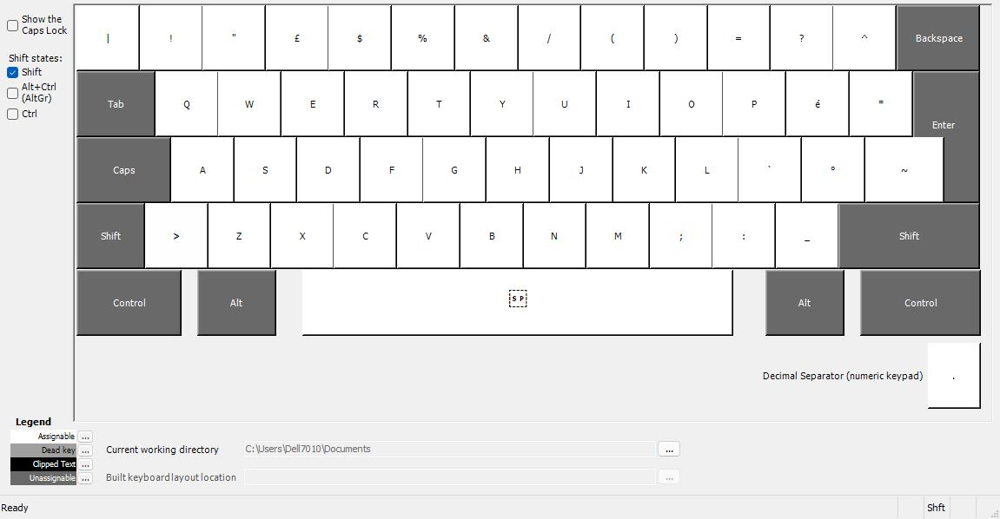
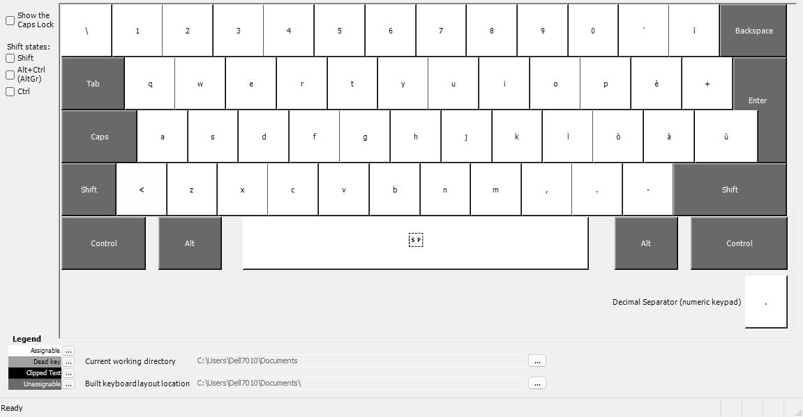

# italian-dev-keyboard-layout
Negli anni '80, con l'avvento degli elaboratori personali, l'Italia si trovò di fronte a una sfida: adattare la tastiera QWERTY alle peculiarità della lingua italiana. Da qui nacque il modello M24 della Olivetti, che introdusse la QWERTY italiana con lettere accentate, unendo efficacemente la funzionalità della tastiera internazionale con le esigenze linguistiche nazionali.

Tuttavia, nel corso degli anni, l'evoluzione tecnologica e le mutate esigenze degli utenti hanno reso necessaria una revisione del layout standard. Il nostro progetto si pone proprio in questa prospettiva di innovazione e adattamento.

## Il Nuovo Standard
Il nostro layout si propone di ottimizzare l'esperienza di digitazione, eliminando tasti poco utilizzati come "ç" e "§", che raramente trovano impiego nella lingua italiana contemporanea. Al loro posto, introduciamo caratteri più utili per gli sviluppatori, come il backtick "`" e la tilde "~", ampiamente impiegati nella programmazione e nella gestione dei sistemi.

## Perché Questo Layout?

#### Migliorata Produttività
Con l'introduzione di caratteri utili per gli sviluppatori direttamente accessibili sulla tastiera, riduciamo il tempo speso per la digitazione, migliorando così la produttività e la fluidità del lavoro.

#### Adattabilità Internazionale
Manteniamo la compatibilità con gli standard internazionali, permettendo agli utenti di lavorare senza problemi anche su piattaforme e con dispositivi stranieri.

#### Modernizzazione del Design
Abbracciamo il cambiamento e l'innovazione, adattando il layout di tastiera alle esigenze attuali degli utenti, in un'ottica di miglioramento continuo.

#### Installazione Semplice
Per usufruire di questo nuovo layout, basta eseguire il file setup.exe incluso nella root della repository. Una volta installato, potrai godere dei vantaggi di una tastiera progettata pensando a te.

Unisciti a noi nella rivoluzione della digitazione italiana! Provaci oggi stesso e scopri quanto può essere efficiente il nostro nuovo layout di tastiera.

Se hai domande o suggerimenti, non esitare a contattarci. Grazie per il tuo interesse nel nostro progetto!

